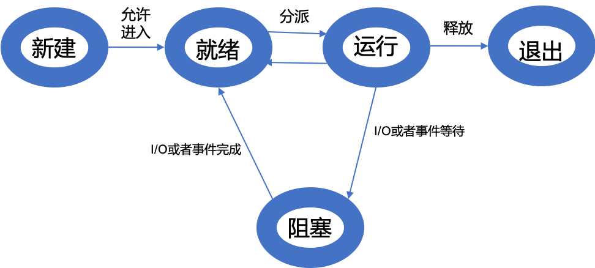

[TOC]

## 前言

宇宙之一粟：记得在上高级计算机体系结构的老师，用着底气十足的口气在第一堂告诉大家：我这门课你不学好，三年后你一定后悔（现在果然后悔了😂），还跟我们说[《计算机体系结构:量化研究方法(第5版)》](https://book.douban.com/subject/20452387/)的法语版译者是他的Boss。果然，大牛还是说得对啊。

操作系统的作用不可言喻，几乎成为校招面试必问知识点之一。为什么呢？只要你在这个互联网世界，自然都离不开操作系统，Win、Mac、Linux、Android、IOS你应该都不陌生吧....操作系统在如今这个世界充当的就是基石的作用，连接计算机底层硬件与上层应用软件的桥梁，控制其他程序的运行，并且管理系统的相关资源，同时还提供配套的系统软件支持。

可能你会说，我不需要了解操作系统我还是可以编程写代码。可是，你想想，毕竟拧螺丝应该不是我们的最终梦想吧。程序员进阶到最后，还是不得不和底层打交道，高并发、内存管理、云原生架构、容器和虚拟化....

果然，我还是拿起了刚刚丢掉的那本书，留下了没技术的泪水。让我们看看操作系统都会问什么问题吧。

> 参考资料：《操作系统之哲学原理》（第2版）
>
> [JavaGuide操作系统基础](https://snailclimb.gitee.io/javaguide/#/docs/operating-system/basis)

------

# 总览

## 入门必问

### 1. 什么是线程和进程，有什么区别？✭✭✭✭✩

PS：[为什么校招面试中“线程与进程的区别”老是被问到?我该如何回答？](https://blog.csdn.net/yuzhou_1shu/article/details/105326063)

#### 1.1 两者概念

进程英文是Process，就像这个名字一样，可以理解成“进行中的程序”。即：

**进程 = 程序+执行**

进程是系统进行**资源分配和调度的**基本单位，是操作系统结构的基础。这里说的资源，包括各种表格、内存空间、磁盘空间、 CPU 的计算资源、I/O 设备的使用权等等。

比如：A进程被放入到进程的就绪队列，进程调度程序选中A，为A分配CPU及上述相关资源，A进程就被运行起来。

> **程序**是指令、数据及其组织形式的描述，进程是程序的实体。程序本身是没有生命周期的，它只是磁盘上的一些指令，程序一旦运行就是进程。

线程是程序执行的基本单位。它是进程的一个实体，是**CPU调度和分配**的基本单位。线程其实是在进程之后并发现进程的某些缺点时才被确定下来的。比如：浏览器同时要处理网络、又要处理鼠标、还要展示内容，进程表示很绝望。

> 每个人在人生的某个时刻，都希望自己能够分身，从而完成某件不可能的事情。进程也是这么想的，要是能分身就好了，于是便有了线程。

#### 1.2 两者区别

1. 进程是资源分配的基本单位；线程是程序执行的基本单位。
2. 进程包括线程，而且可以拥有多个线程；线程必定属于且只能属于一个进程。
3. 进程拥有自己的资源空间，没启动一个进程，系统就会为它分配地址空间，不同进程互相独立；而线程与CPU资源分配无关，多个线程共享同一进程内的资源，使用相同的地址空间。
4. 进程间切换代价大；线程又被称为轻量级进程，线程间切换代价小。
5. 每个进程都有独立的内存空间；而线程共享其所属进程的内存空间。

### 2. 了解过协程吗？✭✭✩✩✩

协程（Coroutine，又称微线程）是一种比线程更加轻量级的存在，协程不是被操作系统内核所管理，而完全是由程序所控制。

协程拥有自己的寄存器上下文和栈。协程调度切换时，将寄存器上下文和栈保存到其他地方，在切回来的时候，恢复先前保存的寄存器上下文和栈，直接操作栈则基本没有内核切换的开销，可以不加锁的访问全局变量，所以上下文的切换非常快。

实现库：Python的gevent、yield； Java 的第三方协程框架，例如 Kilim、Quasar

> 用Donald Knuth的一句话总结协程的特点：“子程序就是协程的一种特例。”
> 

### 3. 操作系统的作用和功能✭✭✩✩✩

**概念：**操作系统（Operating Systems，OS）管理计算机硬件与软件资源的**程序**，是计算机的基石。大白话就是计算机里面的一切事情都由OS来掌控。

那么它掌控什么呢？

> 在远古时代，那个还没有操作系统的年代，计算机由人来掌控，即单一操作员模式。但是随着时代的发展，人已经不能胜任直接掌控计算机了，所以有大牛编写出“操作系统”这个软件来掌控计算机。但是操作系统也不是完美的，所以会有BUG、病毒、攻击。基于此，我们能引申出操作系统的功能。

**功能：**1.替用户及其应用管理计算机上的软硬件的功能；2. 保证计算机资源的公平竞争和使用；3.防止对计算机资源的非法侵占和使用。4. 保证操作系统自身正常运行。

## 通信与同步

#### 1. 进程有哪些状态？

- 创建状态(NEW)：进程正在被创建，操作系统还没有把它加入到可执行进程组中，通常是进程控制块已经创建但是还没有加载到内存中的进程。
- 就绪状态（READY）：进程已经做好了准备，只有有机会就开始执行。
- 运行状态（RUNNING）：该进程正在执行。
- 阻塞状态（WAITING）：进程在某些事情发生前不能执行，等待阻塞进程的事件完成。
- 结束（TERMINATED）：操作系统从可执行进程组中释放出的进程，或由于自身或某种原因停止运行。

### 2. 进程的通信方式✭✭✭✭✩

进程之间的交互称为进程间通信（Inter-Process Communication，IPC）。

> 宇宙之一粟注：这部分内容，如果按照生记硬背的方式，根本不好理解+记忆。在看了《操作系统之哲学原理》相关内容后受益匪浅，所以引用该书的内容来介绍。

进程是人类的创造，人与人之间如何通信？对白沟通、打手势、写信、发电报、拥抱等方法。进程也可以用同样的思考方式。

#### 2.1 进程对白：管道、记名管道、套接字✭✭✭✩✩

人与人之间的对白是通过空气传播声音。那么进程间通过一片共享的存储空间进行传递信息。

1. **管道/匿名管道（Pipe）**：管道所占的空间既可以是内存，也可以是磁盘。同于具有亲缘关系的父子进程间或者兄弟进程之间的通信。
> PS：shell下的`“|“`管道符就是此种方式，`$echo "Hello World" | > hello.txt `

2. **记名管道（Names Pipe）**：匿名管道由于没有名字，只能用于亲缘关系的进程间通信。为了克服这个缺点，提出了记名管道。记名管道严格遵循**先进先出(first in first out)**。记名管道以磁盘文件的方式存在，可以实现本机任意两个进程通信。
3. **套接字（Socket）**：此方法主要用于在客户端和服务器之间通过**网络**进行通信。套接字是支持 TCP/IP 的网络通信的基本操作单元，可以看做是不同主机之间的进程进行双向通信的端点，简单的说就是通信的两方的一种约定，用套接字中的相关函数来完成通信过程。

#### 2.2 进程电报：信号

> 管道和套接字的方式应用广泛，但同时也有一些缺点：首先得建立连接，需要消耗系统资源；其次，通信是自愿的，一方向管道和套接字发送消息，另一方充耳不闻；再者，建立连接需要时间，一旦建立，就会想尽可能多的通信，如果只是通知一个进程某件事情的发生，管道和套接字的方式就有种“杀鸡用牛刀”的味道，效率十分低下。

4. **信号(Signal)** ：信号是一种比较复杂的通信方式，用于通知接收进程某个事件已经发生；

作用：迫使一方对通信立即做出回应；不用事先建立连接，临时起意发个通知；传输信息量微小，使用管道或套接字不划算。

#### 2.3 进程旗语：信号量

> 由E.W.Dijkstra构思，原型来源于铁路的运行：在一条单轨铁路上，任何时候只能有一列列车行驶在上面。而管理这条铁路的系统就是信号量。任何一列火车必须等到表明铁路可以行驶的时候的信号后才能进入轨道。
>
> 一列列车进入单轨运行后，需要将信号改为禁止进入，防止别的火车进入轨道。列出驶出单轨后，信号量变回允许进入状态。

**5. 信号量(Semaphore)** ：信号量是一个计数器，也就是整数，比如0或者1，用于多进程对共享数据的访问。信号量不仅是通信机制，更是一种**同步机制**。这种通信方式主要用于解决与同步相关的问题并避免竞争条件。

#### 2.4 进程拥抱：共享内存✭✭✭✩✩

> 当进程间需要共享大量数据，就像两个人互相非常喜欢，想要更大增进感情（共享大量数据量），打电话、握手、对白等就显得不够，这时候就需要拥抱。进程间的拥抱就是共享内存。

6. **共享内存(Shared memory)** ：使得多个进程可以访问同一块内存空间，不同进程可以及时看到对方进程中对共享内存中数据的更新。这种方式需要依靠某种同步操作，如互斥锁和信号量等。可以说这是**最有用的进程间通信方式**。

#### 2.5 信件发送：消息队列✭✭✭✭✩

> 乍一看，感觉是管道。消息队列不是管道：首先，无需固定的读写进程，任何进程都可以读写；其次，同时支持多个线程，消息队列是多对多，管道是点对点。另外，消息队列只在内存中实现。最后。所有主流操作系统都支持消息队列。

7. **消息队列（Message Queue）**:消息队列是一列具有头和尾的消息排列。具有特定的格式,存放在内存中并由消息队列标识符标识。管道和消息队列的通信数据都是先进先出的原则。与管道（无名管道：只存在于内存中的文件；命名管道：存在于实际的磁盘介质或者文件系统）不同的是消息队列存放在内核中，只有在内核重启(即，操作系统重启)或者显示地删除一个消息队列时，该消息队列才会被真正的删除。消息队列可以实现消息的随机查询,消息不一定要以先进先出的次序读取,也可以按消息的类型读取.比 FIFO 更有优势。**消息队列克服了信号承载信息量少，管道只能承载无格式字节流以及缓冲区大小受限等缺。**

#### 2.6 其他通信方式：

> 主流的进程通信方式就是以上7种，以下这些感兴趣的读者可以自己去了解。

8. Windows支持的IPC包括：剪贴板(clipboard)、COM/DCOM、动态数据交换（DDE）、邮箱（mailslots）；
9. Solaris门机制

### 3. 线程的七态模型

1. 初始状态：一种是实现Runnable接口，一种是继承Thread类，但不管怎样，当我们new了这个对象后，线程就进入了**初始状态**；

2. 可运行状态：当该对象调用了`start()`方法，就进入**可运行状态**；

3. 运行状态：进入可运行状态后，当该对象被操作系统选中，获得CPU时间片就会进入**运行状态**；

运行状态之后，情况分为以下4种：

4. 阻塞状态：当线程调用了自身的sleep()方法或其他线程的join()方法，就会进入阻塞状态（该状态既停止当前线程，但并不释放所占有的资源）。

当sleep()结束或join()结束后，该线程进入可运行状态，继续等待OS分配时间片；

线程调用了yield()方法，意思是放弃当前获得的CPU时间片，回到可运行状态，这时与其他进程处于同等竞争状态，OS有可能会接着又让这个进程进入运行状态；

5. 等待队列：当线程调用wait()方法后会进入**等待队列**（进入这个状态会释放所占有的所有资源，与阻塞状态不同），进入这个状态后，是不能自动唤醒的，必须依靠其他线程调用notify()或notifyAll()方法才能被唤醒（由于notify()只是唤醒一个线程，但我们由不能确定具体唤醒的是哪一个线程，也许我们需要唤醒的线程不能够被唤醒，因此在实际使用时，一般都用notifyAll()方法，唤醒有所线程），线程被唤醒后会进入锁池，等待获取锁标记。

6. 锁池状态：当线程刚进入可运行状态（注意，还没运行），发现将要调用的资源被synchronize

	修饰，获取不到锁标记，将会立即进入**锁池状态**，等待获取锁标记（这时的锁池里也许已经有了其他线程在等待获取锁标记，这时它们处于队列状态，既先到先得），一旦线程获得锁标记后，就转入可运行状态，等待OS分配CPU时间片；

7. 终止状态：`run()`方法或`main()`方法结束后，线程就进入**终止状态**；

### 4. 进程间同步和互斥的区别

**互斥：**是指某一资源同时只允许一个访问者对其进行访问，具有**唯一性**和**排它性**。但互斥无法限制访问者对资源的访问顺序，即访问是无序的。

**同步：**是指在互斥的基础上（大多数情况），通过其它机制实现访问者对资源的有序访问。在大多数情况下，同步已经实现了互斥，特别是所有写入资源的情况必定是互斥的。少数情况是指可以允许多个访问者同时访问资源。

### 5. 线程同步的方式✭✭✩✩✩

> 想想线程的特点，因为不同线程会共享资源。比如：同一个账户，A线程读，B线程取，这样可能会发生冲突，所以需要同步来避免麻烦。
>
> 竞争的方式有两种：代码竞争和数据竞争。代码竞争指多线程环境下，同一时刻两个线程都在同一段代码上。数据竞争指的是两个线程同时访问一个数据。

线程同步是两个或多个共享关键资源的线程的并发执行。同步的作用就是避免关键资源的使用冲突。

同步的方式：（4种）

1. **临界区**（Critical section）：通过对多线程的**串行化**来访问公共资源或一段代码，速度快，适合控制数据访问。在任何时候只允许一个线程访问共享资源，如果有多个线程访问，那么当有一个线程进入后，其他试图访问共享资源的线程将会被挂起，并且等到进入临界区的线程离开，临界在被释放后，其他线程才可以抢占。

2. **互斥量**（Mutex）：为协调对一个共享资源的单独访问而设计。互斥量只有一个，只有拥有互斥量的线程，才有权限去访问系统的公共资源，保证资源不会被多个线程访问。互斥不仅能实现同一个应用程序的公共资源安全共享，还能实现不同应用程序的公共资源安全共享。

	> 比如 Java 中的 synchronized 关键词和各种 Lock 都是这种机制。

3. **信号量**（Semphore）：为控制一个具有有限数量的用户资源而设计。它允许多个线程在同一时刻去访问同一个资源，但一般需要限制同一时刻访问此资源的最大线程数目。

4. **事件**(Event)：用来通知线程有一些事件已发生，从而启动后继任务的开始。

## 内存管理

内存管理：负责内存的分配和回收，`malloc`函数：申请内存；`free`函数：释放内存。另外地址转换也就是将逻辑地址转换成相应的物理地址等功能也是操作系统内存管理做的事情。

### 1. 内存管理有哪几种方式？

常见四种。块式管理、页式管理、段式管理和**段页式**管理。

> 简单分为**连续分配管理方式**和**非连续分配管理方式**这两种。连续分配管理方式是指为一个用户程序分配一个连续的内存空间，常见的如 **块式管理** 。同样地，非连续分配管理方式允许一个程序使用的内存分布在离散或者说不相邻的内存中，常见的如**页式管理** 和 **段式管理**。

1. **块式管理**：把主存分为一大块一大块的。当所需的程序片段不再主存时就分配一块主存空间，把程序片段载入主存。优点：易于管理。缺点：程序片段几个字节也会占用大片内存空间，造成浪费。
2. **页式管理**：把主存分为若干个固定大小的区域，这些区域就是“页”。相对于块式管理，页较小，划分力度更大，提高了内存利用率，减少了碎片。页式管理通过页表对应逻辑地址和物理地址。优点：页的大小固定，方便管理。缺点：页长与程序的逻辑大小没有任何关系。
3. **段式管理：** 段式管理把主存分为一段段的，并且长度可以动态改变。每一段的空间又要比一页的空间小很多 。但是，最重要的是段是有实际意义的，每个段定义了一组逻辑信息，例如,有主程序段 MAIN、子程序段 X、数据段 D 及栈段 S 等。 段式管理通过段表对应逻辑地址和物理地址。
4. **段页式管理：**段页式管理机制结合了段式管理和页式管理的优点。简单来说段页式管理机制就是把主存先分成若干段，每个段又分成若干页，也就是说 **段页式管理机制** 中段与段之间以及段的内部的都是离散的。

### 2. 分页，分段，段页的共同点和区别？

1. 共同点：

	- 分页机制和分段机制都是为了提高内存利用率，较少内存碎片。

	- 页和段都是离散存储的，所以两者都是离散分配内存的方式。但是，每个页和段中的内存是连续的。

2. 区别：

	- 页的大小是固定的，由操作系统决定；而段的大小不固定，取决于我们当前运行的程序。

	- 分页仅仅是为了满足操作系统内存管理的需求，而段是逻辑信息的单位，在程序中可以体现为代码段，数据段，能够更好满足用户的需要。

分页对程序员是不可见的；分段对程序员是可见的，分段为组织程序和数据提供了方便，但对程序员的要求也比较高。

#### 2.1 分段存储的优点：

1. 段具备逻辑独立性，易于编译、管理、修改和保护，也便于多道程序共享
2. 段长可以根据需要动态改变，允许自由调度，以便有效利用主存空间。
3. 方便分段共享、分段保护、动态链接、动态增长

#### 2.2 分段存储的缺点：

1. 段的大小不固定，存储管理变得麻烦。
2. 会生成段内碎片，造成存储空间利用率降低。段式管理比页式管理需要更多的硬件支持。

将分页和分段进行结合，就有了段页式管理。

#### 2.3 段页式的优点：

1. 用分段方法来分配和管理虚拟存储器。程序的地址空间按逻辑单位分为基本独立的段，而每一段有自己的段名，再把每段分成固定大小的若干页。
2. 用分页方法来分配和管理内存，即把整个主存分成与上述大小相等的存储块，可装入作业的任何一页。程序对内存的调入和调出是按页进行的，但它又可按段实现共享和保护。

### 3. 什么是虚拟内存？

虚拟内存，简称虚存，计算机内存管理的一种技术。相对于物理内存而言，可以理解为“假的”内存，它是的应用程序认为它拥有连续可以的内存，允许程序员编写并允许比实际系统拥有的内存大得多的程序。

实际上，虚拟内存通常被分割成多个物理内存碎片，还有部分暂时存储在外部磁盘存储器上。

### 4. 页面置换算法

地址映射过程中，若在页面中发现所要访问的页面不在内存中，则发生缺页中断 。

> **缺页中断** 就是要访问的**页**不在主存，需要操作系统将其调入主存后再进行访问。 在这个时候，被内存映射的文件实际上成了一个分页交换文件。

当发生缺页中断时，如果当前内存中并没有空闲的页面，操作系统就必须在内存选择一个页面将其移出内存，以便为即将调入的页面让出空间。用来选择淘汰哪一页的规则叫做页面置换算法，我们可以把页面置换算法看成是淘汰页面的规则。

- **OPT 页面置换算法（最佳页面置换算法）** ：最佳(Optimal, OPT)置换算法所选择的被淘汰页面将是以后永不使用的，或者是在最长时间内不再被访问的页面,这样可以保证获得最低的缺页率。但由于人们目前无法预知进程在内存下的若千页面中哪个是未来最长时间内不再被访问的，因而该算法无法实现。一般作为衡量其他置换算法的方法。
- **FIFO（First In First Out） 页面置换算法（先进先出页面置换算法）** : 总是淘汰最先进入内存的页面，即选择在内存中驻留时间最久的页面进行淘汰。
- **LRU （Least Currently Used）页面置换算法（最近最久未使用页面置换算法）** ：LRU算法赋予每个页面一个访问字段，用来记录一个页面自上次被访问以来所经历的时间 T，当须淘汰一个页面时，选择现有页面中其 T 值最大的，即最近最久未使用的页面予以淘汰。
- **LFU （Least Frequently Used）页面置换算法（最少使用页面置换算法）** : 该置换算法选择在之前时期使用最少的页面作为淘汰页。

## 其他

### 1. 动态链接库和静态链接库的区别

**静态链接库：**使用的`.lib`文件，库中的代码最后需要链接到可执行文件中去，所以静态链接的可执行文件一般比较大一些。

**动态链接库：**一个包含可由多个程序同时使用的代码和数据的库，它包含函数和数据的模块的集合。程序文件(如.exe文件或.dll文件)在运行时加载这些模块（即所需的模块映射到调用进程的地址空间）。

**相同点：** 都实现了代码的共享

**不同点：**静态链接库.lib文件中的代码被包含在调用的.exe文件中，该.lib文件不能再包含其他动态链接库或者静态链接库。而动态链接库.dll文件可以被调用的.exe动态地“引用”和“卸载”，该.dll文件中可以包含其他动态链接库或者静态链接库。
